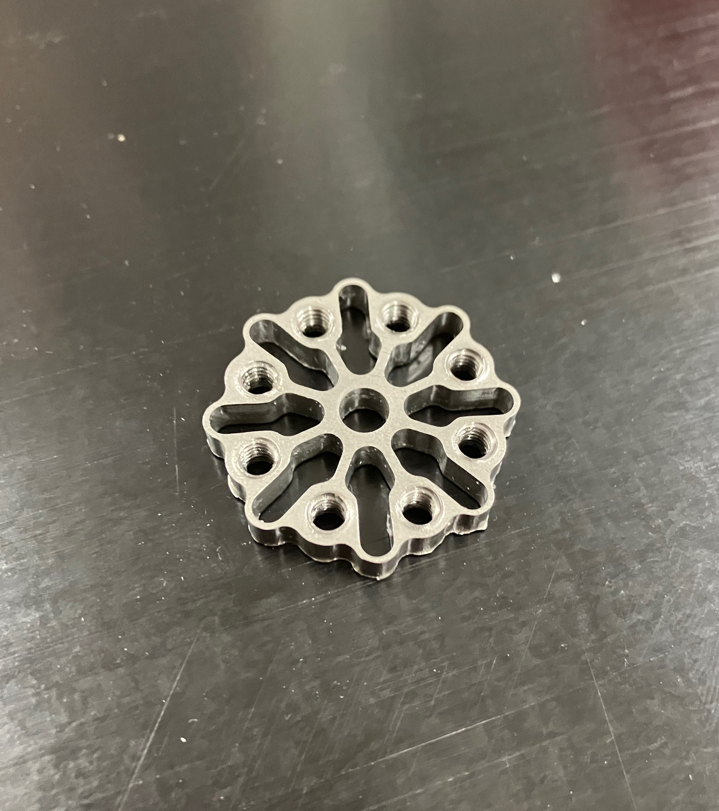

# compliant-mechanisms

This repository comtains design files for my compliant shock-absorbing servo couplers.

|  |
| :----------------------------------------------------: |
|             A stainless steel milled servo coupler          |

|  |
| :----------------------------------------------------: |
|             A 3d printed shock absorbing coupler mounted on a servo. (this design uses rubber o-rings for compliance)          |

|  |
| :----------------------------------------------------: |
|             Design file for an delrin laser-cut servo coupler          |
